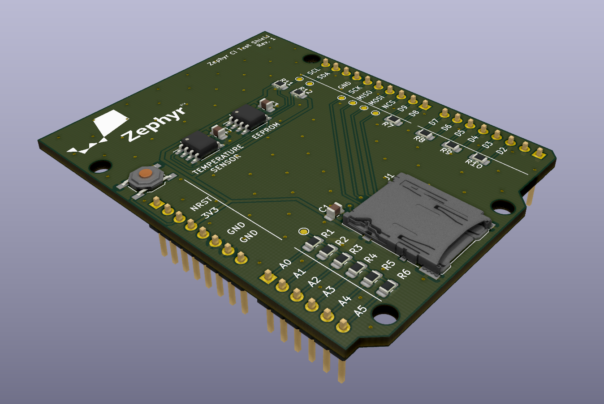

# Zephyr CI Test Shield

This repository contains the board design files for the Zephyr CI Test Shield.
This board is a clone of the ARM mbed CI test shield.

## What is included

* KiCad (5.x) schematic and board files
* Part numbers for JLCPCB assembly (only SMD parts)
* Part numbers from Mouser
* For every revision:
  - Schematic PDF
  - GERBER files
  - BOM and assembly files for JLCPCB
  - Interactive HTML BOM

## Features

* Arduino R3 shield format
* microSD card slot to test SPI
* Resistor star network to test ADC
* EEPROM and temperature sensor to test I2C, EEPROM drivers and sensor drivers
* Loopback pins to test digital inputs, outputs, interrupts, PWM...
* Multiple accessible test points
